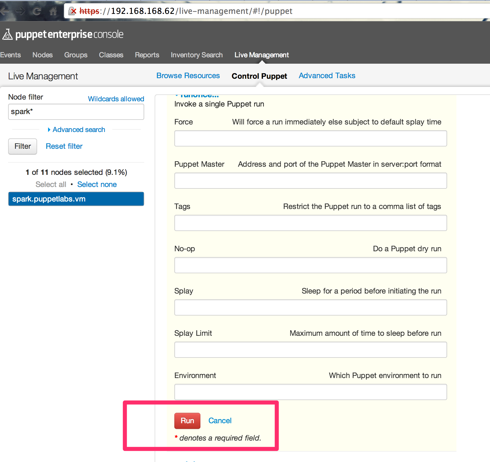

### [root@training ~]# useradd -s /bin/bash -b /home spark

### [root@training ~]# puppet resource user spark

```
user { 'spark':
  ensure           => 'present',
  gid              => '501',
  home             => '/home/spark',
  password         => '!!',
  password_max_age => '99999',
  password_min_age => '0',
  shell            => '/bin/bash',
  uid              => '501',
}
```

```
[root@training ~]# passwd spark
Changing password for user spark.
New password: 
Retype new password: 
passwd: all authentication tokens updated successfully.
```


### [root@training ~]# puppet resource user spark

```
user { 'spark':
  ensure           => 'present',
  gid              => '501',
  home             => '/home/spark',
  password         => '$1$tZO66LmE$QW/8.VhDImFNkksnwn8js1',
  password_max_age => '99999',
  password_min_age => '0',
  shell            => '/bin/bash',
  uid              => '501',
}
```

### [root@training ~]# puppet resource file /etc/hosts

```
file { '/etc/hosts':
  ensure  => 'file',
  content => '{md5}9ccba358391c916ff73d79b7a53d997d',
  ctime   => '2014-08-12 17:06:24 +0000',
  group   => '0',
  mode    => '644',
  mtime   => '2014-08-12 17:06:24 +0000',
  owner   => '0',
  type    => 'file',
}
```

### [root@training ~]# puppet resource service ntp

```
service { 'ntp':
  ensure => 'stopped',
  enable => 'false',
}
```

### [root@training ~]# puppet resource --types

```
augeas
computer
cron
exec
file
filebucket
group
host
interface
k5login
macauthorization
mailalias
maillist
mcx
mount
nagios_command
nagios_contact
nagios_contactgroup
nagios_host
nagios_hostdependency
nagios_hostescalation
nagios_hostextinfo
nagios_hostgroup
nagios_service
nagios_servicedependency
nagios_serviceescalation
nagios_serviceextinfo
nagios_servicegroup
nagios_timeperiod
notify
package
resources
router
schedule
scheduled_task
selboolean
selmodule
service
ssh_authorized_key
sshkey
stage
tidy
user
vlan
whit
yumrepo
zfs
zone
zpool
```

### [root@training ~]# puppet describe --list

```
These are the types known to puppet:
augeas          - Apply a change or an array of changes to the  ...
computer        - Computer object management using DirectorySer ...
cron            - Installs and manages cron jobs
exec            - Executes external commands
file            - Manages files, including their content, owner ...
filebucket      - A repository for storing and retrieving file  ...
group           - Manage groups
host            - Installs and manages host entries
interface       - This represents a router or switch interface
k5login         - Manage the `.k5login` file for a user
macauthorization - Manage the Mac OS X authorization database
mailalias       - .. no documentation ..
maillist        - Manage email lists
mcx             - MCX object management using DirectoryService  ...
mount           - Manages mounted filesystems, including puttin ...
nagios_command  - The Nagios type command
nagios_contact  - The Nagios type contact
nagios_contactgroup - The Nagios type contactgroup
nagios_host     - The Nagios type host
nagios_hostdependency - The Nagios type hostdependency
nagios_hostescalation - The Nagios type hostescalation
nagios_hostextinfo - The Nagios type hostextinfo
nagios_hostgroup - The Nagios type hostgroup
nagios_service  - The Nagios type service
nagios_servicedependency - The Nagios type servicedependency
nagios_serviceescalation - The Nagios type serviceescalation
nagios_serviceextinfo - The Nagios type serviceextinfo
nagios_servicegroup - The Nagios type servicegroup
nagios_timeperiod - The Nagios type timeperiod
notify          - .. no documentation ..
package         - Manage packages
resources       - This is a metatype that can manage other reso ...
router          - .. no documentation ..
schedule        - Define schedules for Puppet
scheduled_task  - Installs and manages Windows Scheduled Tasks
selboolean      - Manages SELinux booleans on systems with SELi ...
selmodule       - Manages loading and unloading of SELinux poli ...
service         - Manage running services
ssh_authorized_key - Manages SSH authorized keys
sshkey          - Installs and manages ssh host keys
stage           - A resource type for creating new run stages
tidy            - Remove unwanted files based on specific crite ...
user            - Manage users
vlan            - .. no documentation ..
whit            - Whits are internal artifacts of Puppet's curr ...
yumrepo         - The client-side description of a yum reposito ...
zfs             - Manage zfs
zone            - Manages Solaris zones
zpool           - Manage zpools
```

### [root@training ~]# puppet resource --help

```
puppet-resource(8) -- The resource abstraction layer shell
========

SYNOPSIS
--------
Uses the Puppet RAL to directly interact with the system.


USAGE
-----
puppet resource [-h|--help] [-d|--debug] [-v|--verbose] [-e|--edit]
  [-H|--host <host>] [-p|--param <parameter>] [-t|--types] <type>
  [<name>] [<attribute>=<value> ...]


DESCRIPTION
-----------
This command provides simple facilities for converting current system
state into Puppet code, along with some ability to modify the current
state using Puppet's RAL.

By default, you must at least provide a type to list, in which case
puppet resource will tell you everything it knows about all resources of
that type. You can optionally specify an instance name, and puppet
resource will only describe that single instance.

If given a type, a name, and a series of <attribute>=<value> pairs,
puppet resource will modify the state of the specified resource.
Alternately, if given a type, a name, and the '--edit' flag, puppet
resource will write its output to a file, open that file in an editor,
and then apply the saved file as a Puppet transaction.


OPTIONS
-------
Note that any setting that's valid in the configuration
file is also a valid long argument. For example, 'ssldir' is a valid
setting, so you can specify '--ssldir <directory>' as an
argument.

See the configuration file documentation at
http://docs.puppetlabs.com/references/stable/configuration.html for the
full list of acceptable parameters. A commented list of all
configuration options can also be generated by running puppet with
'--genconfig'.

* --debug:
  Enable full debugging.

* --edit:
  Write the results of the query to a file, open the file in an editor,
  and read the file back in as an executable Puppet manifest.

* --host:
  When specified, connect to the resource server on the named host
  and retrieve the list of resouces of the type specified.

* --help:
  Print this help message.

* --param:
  Add more parameters to be outputted from queries.

* --types:
  List all available types.

* --verbose:
  Print extra information.


EXAMPLE
-------
This example uses `puppet resource` to return a Puppet configuration for
the user `luke`:

    $ puppet resource user luke
    user { 'luke':
     home => '/home/luke',
     uid => '100',
     ensure => 'present',
     comment => 'Luke Kanies,,,',
     gid => '1000',
     shell => '/bin/bash',
     groups => ['sysadmin','audio','video','puppet']
    }


AUTHOR
------
Luke Kanies


COPYRIGHT
---------
Copyright (c) 2011 Puppet Labs, LLC Licensed under the Apache 2.0 License
```


> After the master signed all certificates with using 'puppet cert sign --all'


### [root@training ~]# puppet agent -t

```
Notice: Run of Puppet configuration client already in progress; skipping  (/var/opt/lib/pe-puppet/state/agent_catalog_run.lock exists)
```


### [root@training ~]# puppet agent -t

```
Info: Retrieving plugin
Notice: /File[/var/opt/lib/pe-puppet/lib/puppetpe/puppetlabs/pe_console/config.rb]/ensure: defined content as '{md5}5ef248d7814aa1df12cb44db77d11771'
Notice: /File[/var/opt/lib/pe-puppet/lib/puppetpe/puppetlabs/pe_console/console_http.rb]/ensure: defined content as '{md5}29f2414703a7f452a6fee8c3d9d382de'
Notice: /File[/var/opt/lib/pe-puppet/lib/puppetpe/puppetlabs/pe_console/ssl]/ensure: created
Notice: /File[/var/opt/lib/pe-puppet/lib/puppetpe/puppetlabs/pe_console/ssl/validator]/ensure: created
Notice: /File[/var/opt/lib/pe-puppet/lib/puppetpe/puppetlabs/pe_console/ssl/validator/certname_validator.rb]/ensure: defined content as '{md5}a2328ee41af7a5a8583ec1ab20b88275'
Info: Loading facts in /var/opt/lib/pe-puppet/lib/facter/concat_basedir.rb
Info: Loading facts in /var/opt/lib/pe-puppet/lib/facter/iptables_persistent_version.rb
Info: Loading facts in /var/opt/lib/pe-puppet/lib/facter/postgres_default_version.rb
Info: Loading facts in /var/opt/lib/pe-puppet/lib/facter/pe_postgres_default_version.rb
Info: Loading facts in /var/opt/lib/pe-puppet/lib/facter/root_home.rb
Info: Loading facts in /var/opt/lib/pe-puppet/lib/facter/puppet_vardir.rb
Info: Loading facts in /var/opt/lib/pe-puppet/lib/facter/iptables_version.rb
Info: Loading facts in /var/opt/lib/pe-puppet/lib/facter/ip6tables_version.rb
Info: Loading facts in /var/opt/lib/pe-puppet/lib/facter/pe_build.rb
Info: Loading facts in /var/opt/lib/pe-puppet/lib/facter/pe_version.rb
Info: Loading facts in /var/opt/lib/pe-puppet/lib/facter/pe_puppetdb_server_status.rb
Info: Loading facts in /var/opt/lib/pe-puppet/lib/facter/custom_auth_conf.rb
Info: Loading facts in /var/opt/lib/pe-puppet/lib/facter/root_ssh_key.rb
Info: Loading facts in /var/opt/lib/pe-puppet/lib/facter/staging_http_get.rb
Info: Loading facts in /var/opt/lib/pe-puppet/lib/facter/platform_tag.rb
Info: Loading facts in /var/opt/lib/pe-puppet/lib/facter/windows.rb
Info: Loading facts in /var/opt/lib/pe-puppet/lib/facter/fundamentals_pe_version.rb
Info: Loading facts in /var/opt/lib/pe-puppet/lib/facter/facter_dot_d.rb
Info: Caching catalog for spark.puppetlabs.vm
Info: Applying configuration version '1407864732'
Notice: /Stage[main]/Pe_mcollective::Server::Plugins/File[/opt/puppet/libexec/mcollective/mcollective/agent/package.ddl]/ensure: defined content as '{md5}12f8dce7d996343068b9372f110279ed'
Notice: /Stage[main]/Pe_mcollective::Server::Plugins/File[/opt/puppet/libexec/mcollective/mcollective/agent/package.rb]/ensure: defined content as '{md5}51d279e034f236194a9bf45461cb6033'
Notice: /Stage[main]/Pe_mcollective::Server::Plugins/File[/opt/puppet/libexec/mcollective/mcollective/agent/puppet.ddl]/ensure: defined content as '{md5}e4de626b4ab250eab8bf33cfb303275d'
Notice: /Stage[main]/Pe_mcollective::Server::Plugins/File[/opt/puppet/libexec/mcollective/mcollective/agent/puppet.rb]/ensure: defined content as '{md5}d356b352d78f58ba48b66c4f56a86cf9'
Notice: /Stage[main]/Pe_mcollective::Server::Plugins/File[/opt/puppet/libexec/mcollective/mcollective/agent/puppetral.ddl]/ensure: defined content as '{md5}7f06f13953847e60818a681c1f2f168b'
Notice: /Stage[main]/Pe_mcollective::Server::Plugins/File[/opt/puppet/libexec/mcollective/mcollective/agent/puppetral.rb]/ensure: defined content as '{md5}5bc9d72845574a3fc08c9062b4b28dd3'
Notice: /Stage[main]/Pe_mcollective::Server::Plugins/File[/opt/puppet/libexec/mcollective/mcollective/agent/service.ddl]/ensure: defined content as '{md5}59ab37f55d8e16fda6a2103682545934'
Notice: /Stage[main]/Pe_mcollective::Server::Plugins/File[/opt/puppet/libexec/mcollective/mcollective/agent/service.rb]/ensure: defined content as '{md5}cbf84ed615eeda9789650b05ec504566'
Notice: /Stage[main]/Pe_mcollective::Server::Plugins/File[/opt/puppet/libexec/mcollective/mcollective/aggregate]/ensure: created
Notice: /Stage[main]/Pe_mcollective::Server::Plugins/File[/opt/puppet/libexec/mcollective/mcollective/aggregate/boolean_summary.ddl]/ensure: defined content as '{md5}aa581c71a6c7658bffdbaec81590f65d'
Notice: /Stage[main]/Pe_mcollective::Server::Plugins/File[/opt/puppet/libexec/mcollective/mcollective/aggregate/boolean_summary.rb]/ensure: defined content as '{md5}0546063313508d8aff603be320af3c44'
Notice: /Stage[main]/Pe_mcollective::Server::Plugins/File[/opt/puppet/libexec/mcollective/mcollective/application]/ensure: created
Notice: /Stage[main]/Pe_mcollective::Server::Plugins/File[/opt/puppet/libexec/mcollective/mcollective/application/package.rb]/ensure: defined content as '{md5}afcd9a561b087049eccb648a940b592e'
Notice: /Stage[main]/Pe_mcollective::Server::Plugins/File[/opt/puppet/libexec/mcollective/mcollective/application/puppet.rb]/ensure: defined content as '{md5}d7d9a8470ad988c3e2fcb4e34e4132df'
Notice: /Stage[main]/Pe_mcollective::Server::Plugins/File[/opt/puppet/libexec/mcollective/mcollective/application/service.rb]/ensure: defined content as '{md5}799681457f0f707a7166da086f97e473'
Notice: /Stage[main]/Pe_mcollective::Server::Plugins/File[/opt/puppet/libexec/mcollective/mcollective/data/puppet_data.ddl]/ensure: defined content as '{md5}5c9912bf5ae5dbc8762109a40c027c63'
Notice: /Stage[main]/Pe_mcollective::Server::Plugins/File[/opt/puppet/libexec/mcollective/mcollective/data/puppet_data.rb]/ensure: defined content as '{md5}021d22f47251cd3027ba1777e3503d72'
Notice: /Stage[main]/Pe_mcollective::Server::Plugins/File[/opt/puppet/libexec/mcollective/mcollective/data/resource_data.ddl]/ensure: defined content as '{md5}c4e3a46fd3c0b5d3990db0b8af1c747f'
Notice: /Stage[main]/Pe_mcollective::Server::Plugins/File[/opt/puppet/libexec/mcollective/mcollective/data/resource_data.rb]/ensure: defined content as '{md5}41e785704e01cfab6a6c88ebd921bbb9'
Notice: /Stage[main]/Pe_mcollective::Server::Plugins/File[/opt/puppet/libexec/mcollective/mcollective/data/service_data.ddl]/ensure: defined content as '{md5}e7f7e0bc65ede56fc636505a400b1700'
Notice: /Stage[main]/Pe_mcollective::Server::Plugins/File[/opt/puppet/libexec/mcollective/mcollective/data/service_data.rb]/ensure: defined content as '{md5}bc651898c7dcd373d609c933fbd6021f'
Notice: /Stage[main]/Pe_mcollective::Server::Plugins/File[/opt/puppet/libexec/mcollective/mcollective/registration/meta.rb]/ensure: defined content as '{md5}e939958bbbc0817e1779c336037e1849'
Notice: /Stage[main]/Pe_mcollective::Server::Plugins/File[/opt/puppet/libexec/mcollective/mcollective/security/sshkey.rb]/ensure: defined content as '{md5}8fa3e9125fd917948445e3d2621d40e5'
Notice: /Stage[main]/Pe_mcollective::Server::Plugins/File[/opt/puppet/libexec/mcollective/mcollective/util]/ensure: created
Notice: /Stage[main]/Pe_mcollective::Server::Plugins/File[/opt/puppet/libexec/mcollective/mcollective/util/actionpolicy.rb]/ensure: defined content as '{md5}e4d6a7024ad7b28e019e7b9931eac027'
Notice: /Stage[main]/Pe_mcollective::Server::Plugins/File[/opt/puppet/libexec/mcollective/mcollective/util/package]/ensure: created
Notice: /Stage[main]/Pe_mcollective::Server::Plugins/File[/opt/puppet/libexec/mcollective/mcollective/util/package/base.rb]/ensure: defined content as '{md5}1bdb7e7a6dcfea6fd2a06c5dc39b7276'
Notice: /Stage[main]/Pe_mcollective::Server::Plugins/File[/opt/puppet/libexec/mcollective/mcollective/util/package/packagehelpers.rb]/ensure: defined content as '{md5}af83db4ea2647516e50358df4166e571'
Notice: /Stage[main]/Pe_mcollective::Server::Plugins/File[/opt/puppet/libexec/mcollective/mcollective/util/package/puppetpackage.rb]/ensure: defined content as '{md5}161b48fa538e0ddd0118ab09f9405c51'
Notice: /Stage[main]/Pe_mcollective::Server::Plugins/File[/opt/puppet/libexec/mcollective/mcollective/util/puppet_agent_mgr]/ensure: created
Notice: /Stage[main]/Pe_mcollective::Server::Plugins/File[/opt/puppet/libexec/mcollective/mcollective/util/puppet_agent_mgr.rb]/ensure: defined content as '{md5}04efaa640da811eb6c85eba52d55a634'
Notice: /Stage[main]/Pe_mcollective::Server::Plugins/File[/opt/puppet/libexec/mcollective/mcollective/util/puppet_agent_mgr/common.rb]/ensure: defined content as '{md5}74008c983796275b69b8790fd527c6a6'
Notice: /Stage[main]/Pe_mcollective::Server::Plugins/File[/opt/puppet/libexec/mcollective/mcollective/util/puppet_agent_mgr/v2]/ensure: created
Notice: /Stage[main]/Pe_mcollective::Server::Plugins/File[/opt/puppet/libexec/mcollective/mcollective/util/puppet_agent_mgr/v2/manager.rb]/ensure: defined content as '{md5}4b382b289182cf86161ecfde337b0229'
Notice: /Stage[main]/Pe_mcollective::Server::Plugins/File[/opt/puppet/libexec/mcollective/mcollective/util/puppet_agent_mgr/v2/unix.rb]/ensure: defined content as '{md5}837b18f8978e0da5ae1fac5f96790e5b'
Notice: /Stage[main]/Pe_mcollective::Server::Plugins/File[/opt/puppet/libexec/mcollective/mcollective/util/puppet_agent_mgr/v2/windows.rb]/ensure: defined content as '{md5}3f9d91026b11241a53bd4120d86fc625'
Notice: /Stage[main]/Pe_mcollective::Server::Plugins/File[/opt/puppet/libexec/mcollective/mcollective/util/puppet_agent_mgr/v3]/ensure: created
Notice: /Stage[main]/Pe_mcollective::Server::Plugins/File[/opt/puppet/libexec/mcollective/mcollective/util/puppet_agent_mgr/v3/manager.rb]/ensure: defined content as '{md5}149eb66a83db5f0b8e83668f188d5cb7'
Notice: /Stage[main]/Pe_mcollective::Server::Plugins/File[/opt/puppet/libexec/mcollective/mcollective/util/puppet_agent_mgr/v3/unix.rb]/ensure: defined content as '{md5}324c9117d881ca05d99bcf9ca93f9a9e'
Notice: /Stage[main]/Pe_mcollective::Server::Plugins/File[/opt/puppet/libexec/mcollective/mcollective/util/puppet_agent_mgr/v3/windows.rb]/ensure: defined content as '{md5}58ce963815276914a28ef3445540c2d1'
Notice: /Stage[main]/Pe_mcollective::Server::Plugins/File[/opt/puppet/libexec/mcollective/mcollective/util/puppetrunner.rb]/ensure: defined content as '{md5}9754554827cb37b768c63beac35da49b'
Notice: /Stage[main]/Pe_mcollective::Server::Plugins/File[/opt/puppet/libexec/mcollective/mcollective/util/service]/ensure: created
Notice: /Stage[main]/Pe_mcollective::Server::Plugins/File[/opt/puppet/libexec/mcollective/mcollective/util/service/base.rb]/ensure: defined content as '{md5}abea7b8fadbf3425a7b68b49b9435ff6'
Notice: /Stage[main]/Pe_mcollective::Server::Plugins/File[/opt/puppet/libexec/mcollective/mcollective/util/service/puppetservice.rb]/ensure: defined content as '{md5}905db93e1c06ad5a7154fa2f9199f31c'
Notice: /Stage[main]/Pe_mcollective::Server::Plugins/File[/opt/puppet/libexec/mcollective/mcollective/validator/puppet_resource_validator.ddl]/ensure: defined content as '{md5}3e45a28e1ba6c8d22ce40934c04b30b4'
Notice: /Stage[main]/Pe_mcollective::Server::Plugins/File[/opt/puppet/libexec/mcollective/mcollective/validator/puppet_resource_validator.rb]/ensure: defined content as '{md5}567c7dc4d70ed0db7fd2626c77f6df41'
Notice: /Stage[main]/Pe_mcollective::Server::Plugins/File[/opt/puppet/libexec/mcollective/mcollective/validator/puppet_server_address_validator.ddl]/ensure: defined content as '{md5}323e0b9647639fdf32cfbc63a82860f7'
Notice: /Stage[main]/Pe_mcollective::Server::Plugins/File[/opt/puppet/libexec/mcollective/mcollective/validator/puppet_server_address_validator.rb]/ensure: defined content as '{md5}9824a78753512eaecb65a95e93cd874b'
Notice: /Stage[main]/Pe_mcollective::Server::Plugins/File[/opt/puppet/libexec/mcollective/mcollective/validator/puppet_tags_validator.ddl]/ensure: defined content as '{md5}7ed95b2e5b210db83d12d5034f1ecb0f'
Notice: /Stage[main]/Pe_mcollective::Server::Plugins/File[/opt/puppet/libexec/mcollective/mcollective/validator/puppet_tags_validator.rb]/ensure: defined content as '{md5}40b29498e867ba2ecf21dc08bc457d4e'
Notice: /Stage[main]/Pe_mcollective::Server::Plugins/File[/opt/puppet/libexec/mcollective/mcollective/validator/puppet_variable_validator.ddl]/ensure: defined content as '{md5}58c9db4ca4503e4d692a016743e01627'
Notice: /Stage[main]/Pe_mcollective::Server::Plugins/File[/opt/puppet/libexec/mcollective/mcollective/validator/puppet_variable_validator.rb]/ensure: defined content as '{md5}3cbca3af2e5884f2a807ef005a87151b'
Notice: /Stage[main]/Pe_mcollective::Server::Plugins/File[/opt/puppet/libexec/mcollective/mcollective/validator/service_name.ddl]/ensure: defined content as '{md5}2812afa15108103042f706c2201e286b'
Notice: /Stage[main]/Pe_mcollective::Server::Plugins/File[/opt/puppet/libexec/mcollective/mcollective/validator/service_name.rb]/ensure: defined content as '{md5}3f501a9ed252ce2dfe06a2e1e53845ab'
Info: /opt/puppet/libexec/mcollective/mcollective: Scheduling refresh of Service[pe-mcollective]
Notice: /Stage[main]/Pe_mcollective::Shared_key_files/File[mcollective-public.pem]/ensure: defined content as '{md5}9b12a5148b4ee100bffe4e0fe677bd18'
Info: /Stage[main]/Pe_mcollective::Shared_key_files/File[mcollective-public.pem]: Scheduling refresh of Service[pe-mcollective]
Notice: /Stage[main]/Pe_mcollective::Shared_key_files/File[mcollective-private.pem]/ensure: defined content as '{md5}faef425dcd5ec30d6e7e91e2c95acabc'
Info: /Stage[main]/Pe_mcollective::Shared_key_files/File[mcollective-private.pem]: Scheduling refresh of Service[pe-mcollective]
Notice: /Stage[main]/Pe_mcollective::Shared_key_files/File[mcollective-cert.pem]/ensure: defined content as '{md5}5df9217c1d6ac2110df475665aaa7ee2'
Info: /Stage[main]/Pe_mcollective::Shared_key_files/File[mcollective-cert.pem]: Scheduling refresh of Service[pe-mcollective]
Notice: /Stage[main]/Pe_mcollective::Shared_key_files/File[mcollective-cacert.pem]/ensure: defined content as '{md5}658f3aa38e96c2d6d4ad81633f4d0fe9'
Info: /Stage[main]/Pe_mcollective::Shared_key_files/File[mcollective-cacert.pem]: Scheduling refresh of Service[pe-mcollective]
Notice: /Stage[main]/Pe_mcollective::Shared_key_files/File[peadmin-public.pem]/ensure: defined content as '{md5}6834e381052b600dc3d8139653596815'
Info: /Stage[main]/Pe_mcollective::Shared_key_files/File[peadmin-public.pem]: Scheduling refresh of Service[pe-mcollective]
Notice: /Stage[main]/Pe_mcollective::Shared_key_files/File[puppet-dashboard-public.pem]/ensure: defined content as '{md5}c5d21fe6dd1d74e90ba61b8211b6bbfc'
Info: /Stage[main]/Pe_mcollective::Shared_key_files/File[puppet-dashboard-public.pem]: Scheduling refresh of Service[pe-mcollective]
Notice: /Stage[main]/Pe_mcollective::Server/File[/var/log/pe-mcollective/mcollective-audit.log]/ensure: created
Notice: /Stage[main]/Pe_mcollective::Server/File[/etc/puppetlabs/mcollective/server.cfg]/content: 
--- /etc/puppetlabs/mcollective/server.cfg  2014-06-23 23:36:43.000000000 +0000
+++ /tmp/puppet-file20140812-3530-12cncmo 2014-08-12 17:32:52.251786544 +0000
@@ -1,22 +1,60 @@
+# Centrally managed by Puppet version 3.6.2 (Puppet Enterprise 3.3.0)
 main_collective = mcollective
-collectives = mcollective
-libdir = /usr/libexec/mcollective
-logfile = /var/log/mcollective.log
-loglevel = info
-daemonize = 1
+collectives     = mcollective
+libdir          = /opt/puppet/libexec/mcollective/
+logfile         = /var/log/pe-mcollective/mcollective.log
+loglevel        = info
 
+# Log plugin configuration
+plugin.rpcaudit.logfile = /var/log/pe-mcollective/mcollective-audit.log
+rpcaudit = 1
+rpcauditprovider = Logfile
+
+daemonize       = 1
+
+identity = spark.puppetlabs.vm
 # Plugins
-securityprovider = psk
-plugin.psk = unset
+securityprovider           = ssl
+plugin.ssl_server_private = /etc/puppetlabs/mcollective/ssl/mcollective-private.pem
+plugin.ssl_server_public = /etc/puppetlabs/mcollective/ssl/mcollective-public.pem
+plugin.ssl_client_cert_dir = /etc/puppetlabs/mcollective/ssl/clients/
+plugin.ssl_serializer     = yaml
 
 connector = activemq
 plugin.activemq.pool.size = 1
-plugin.activemq.pool.1.host = stomp1
-plugin.activemq.pool.1.port = 6163
+plugin.activemq.pool.1.host = master.puppetlabs.vm
+plugin.activemq.pool.1.port = 61613
 plugin.activemq.pool.1.user = mcollective
-plugin.activemq.pool.1.password = marionette
+plugin.activemq.pool.1.password = Fd2t5WMTSsIDrauxK2c2
+plugin.activemq.pool.1.ssl = true
+plugin.activemq.pool.1.ssl.ca = /etc/puppetlabs/mcollective/ssl/mcollective-cacert.pem
+plugin.activemq.pool.1.ssl.key = /etc/puppetlabs/mcollective/ssl/mcollective-private.pem
+plugin.activemq.pool.1.ssl.cert = /etc/puppetlabs/mcollective/ssl/mcollective-cert.pem
 
 # Facts
 factsource = yaml
-plugin.yaml = /etc/mcollective/facts.yaml
+plugin.yaml = /etc/puppetlabs/mcollective/facts.yaml
+
+# Puppet Classes
+classesfile = /var/opt/lib/pe-puppet/classes.txt
+
+# Puppet Agent plugin configuration
+plugin.puppet.command = /opt/puppet/bin/puppet agent
+plugin.puppet.config  = /etc/puppetlabs/puppet/puppet.conf
+
+plugin.puppet.splay = true
+plugin.puppet.splaylimit = 120
+
+# Periodcally broadcast metdata for registration purposes.
+# This registration plugin will broadcast current Facter fact values.
+registration = Meta
+# registerinterval is intentionally "long" to prevent systems from being overly
+# chatty on the message bus by default.  If you want a higher frequency, this
+# may be set to 300 (5 minutes)
+registerinterval = 600
 
+# authorization
+rpcauthorization = 1
+rpcauthprovider = action_policy
+plugin.actionpolicy.allow_unconfigured = 1
+direct_addressing = 1

Info: /Stage[main]/Pe_mcollective::Server/File[/etc/puppetlabs/mcollective/server.cfg]: Filebucketed /etc/puppetlabs/mcollective/server.cfg to main with sum 64c560a3fc9cd6eb8db387224b3b3c02
Notice: /Stage[main]/Pe_mcollective::Server/File[/etc/puppetlabs/mcollective/server.cfg]/content: content changed '{md5}64c560a3fc9cd6eb8db387224b3b3c02' to '{md5}ac7464307b19e683d812ab6082f0c6ee'
Notice: /Stage[main]/Pe_mcollective::Server/File[/etc/puppetlabs/mcollective/server.cfg]/mode: mode changed '0644' to '0660'
Info: /Stage[main]/Pe_mcollective::Server/File[/etc/puppetlabs/mcollective/server.cfg]: Scheduling refresh of Service[pe-mcollective]
Info: /Stage[main]/Pe_mcollective::Server/File[/etc/puppetlabs/mcollective/server.cfg]: Scheduling refresh of Service[pe-mcollective]
Notice: /Stage[main]/Pe_mcollective::Server/Service[pe-mcollective]/ensure: ensure changed 'stopped' to 'running'
Info: /Stage[main]/Pe_mcollective::Server/Service[pe-mcollective]: Unscheduling refresh on Service[pe-mcollective]
Notice: /Stage[main]/Pe_mcollective::Server/File[/opt/puppet/sbin/refresh-mcollective-metadata]/ensure: defined content as '{md5}3d950cdcfcc2d77efc84909b191eaeea'
Notice: /Stage[main]/Pe_mcollective::Server/Cron[pe-mcollective-metadata]/ensure: created
Notice: Finished catalog run in 38.62 seconds
```

### [root@training ~]# puppet agent -t

```
Info: Retrieving plugin
Info: Loading facts in /var/opt/lib/pe-puppet/lib/facter/concat_basedir.rb
Info: Loading facts in /var/opt/lib/pe-puppet/lib/facter/iptables_persistent_version.rb
Info: Loading facts in /var/opt/lib/pe-puppet/lib/facter/postgres_default_version.rb
Info: Loading facts in /var/opt/lib/pe-puppet/lib/facter/pe_postgres_default_version.rb
Info: Loading facts in /var/opt/lib/pe-puppet/lib/facter/root_home.rb
Info: Loading facts in /var/opt/lib/pe-puppet/lib/facter/puppet_vardir.rb
Info: Loading facts in /var/opt/lib/pe-puppet/lib/facter/iptables_version.rb
Info: Loading facts in /var/opt/lib/pe-puppet/lib/facter/ip6tables_version.rb
Info: Loading facts in /var/opt/lib/pe-puppet/lib/facter/pe_build.rb
Info: Loading facts in /var/opt/lib/pe-puppet/lib/facter/pe_version.rb
Info: Loading facts in /var/opt/lib/pe-puppet/lib/facter/pe_puppetdb_server_status.rb
Info: Loading facts in /var/opt/lib/pe-puppet/lib/facter/custom_auth_conf.rb
Info: Loading facts in /var/opt/lib/pe-puppet/lib/facter/root_ssh_key.rb
Info: Loading facts in /var/opt/lib/pe-puppet/lib/facter/staging_http_get.rb
Info: Loading facts in /var/opt/lib/pe-puppet/lib/facter/platform_tag.rb
Info: Loading facts in /var/opt/lib/pe-puppet/lib/facter/windows.rb
Info: Loading facts in /var/opt/lib/pe-puppet/lib/facter/fundamentals_pe_version.rb
Info: Loading facts in /var/opt/lib/pe-puppet/lib/facter/facter_dot_d.rb
Info: Caching catalog for spark.puppetlabs.vm
Warning: The package type's allow_virtual parameter will be changing its default value from false to true in a future release. If you do not want to allow virtual packages, please explicitly set allow_virtual to false.
   (at /opt/puppet/lib/ruby/site_ruby/1.9.1/puppet/type.rb:816:in `set_default')
Info: Applying configuration version '1407865832'
Notice: Finished catalog run in 4.43 seconds
```

### Git workflow

```
[root@training ~/puppetcode]# git add site.pp 
[root@training ~/puppetcode]# git commit -m 'initial commit'
[master (root-commit) 4945129] initial commit
 1 files changed, 44 insertions(+), 0 deletions(-)
 create mode 100644 site.pp
[root@training ~/puppetcode:master±]# 
[root@training ~/puppetcode:master±]# 
```

### [root@training ~/puppetcode:master±]# cat site.pp 

```
## site.pp ##

# This file (/etc/puppetlabs/puppet/manifests/site.pp) is the main entry point
# used when an agent connects to a master and asks for an updated configuration.
#
# Global objects like filebuckets and resource defaults should go in this file,
# as should the default node definition. (The default node can be omitted
# if you use the console and don't define any other nodes in site.pp. See
# http://docs.puppetlabs.com/guides/language_guide.html#nodes for more on
# node definitions.)

## Active Configurations ##

# PRIMARY FILEBUCKET
# This configures puppet agent and puppet inspect to back up file contents when
# they run. The Puppet Enterprise console needs this to display file contents
# and differences.

# Define filebucket 'main':
filebucket { 'main':
  server => 'master.puppetlabs.vm',
  path   => false,
}

# Make filebucket 'main' the default backup location for all File resources:
File { backup => 'main' }

# DEFAULT NODE
# Node definitions in this file are merged with node data from the console. See
# http://docs.puppetlabs.com/guides/language_guide.html#nodes for more on
# node definitions.

# The default node definition matches any node lacking a more specific node
# definition. If there are no other nodes in this file, classes declared here
# will be included in every node's catalog, *in addition* to any classes
# specified in the console for that node.

node default {
  # This is where you can declare classes for all nodes.
  # Example:
  #   class { 'my_class': }
  notify { "Hello ${fqdn}": }
}
```

### [root@training ~/puppetcode:master±]# tree

```
.
├── hieradata
│   └── defaults.yaml
├── hiera.yaml
├── modules
└── site.pp

2 directories, 3 files
[root@training ~/puppetcode:master±]# cd /etc/puppetlabs
[root@training /etc/puppetlabs]# ll
total 8
drwxr-xr-x 4 root root 4096 Aug 12 18:00 mcollective
drwxr-xr-x 3 root root 4096 Aug 12 17:39 puppet
[root@training /etc/puppetlabs]# cd puppet/
[root@training /etc/puppetlabs/puppet]# ll
total 16
-rw-r--r-- 1 root      root      4178 Jun 17 21:30 auth.conf
lrwxrwxrwx 1 root      root        26 Aug 12 17:39 hieradata -> /root/puppetcode/hieradata
lrwxrwxrwx 1 root      root        27 Aug 12 17:39 hiera.yaml -> /root/puppetcode/hiera.yaml
lrwxrwxrwx 1 root      root        24 Aug 12 17:39 modules -> /root/puppetcode/modules
-rw-r--r-- 1 root      root       491 Aug 12 17:07 puppet.conf
drwxrwx--x 8 pe-puppet pe-puppet 4096 Aug 12 17:29 ssl
[root@training /etc/puppetlabs/puppet]# cd ~/puppetcode/
[root@training ~/puppetcode:master±]# 
[root@training ~/puppetcode:master±]# 
[root@training ~/puppetcode:master±]# 
[root@training ~/puppetcode:master±]# git log
commit 49451295f1ae2a93b15414b08efd2e4ee629fa7b
Author: spark <spark@puppetlabs.vm>
Date:   Tue Aug 12 17:57:48 2014 +0000

    initial commit
```

### [root@training ~/puppetcode:master±]# git push origin master

```
The authenticity of host 'master.puppetlabs.vm (192.168.168.62)' can't be established.
RSA key fingerprint is a4:43:30:c7:fb:2c:3c:70:42:69:86:dc:d9:ba:e1:49.
Are you sure you want to continue connecting (yes/no)? yes
Warning: Permanently added 'master.puppetlabs.vm,192.168.168.62' (RSA) to the list of known hosts.
Counting objects: 3, done.
Compressing objects: 100% (2/2), done.
Writing objects: 100% (3/3), 931 bytes, done.
Total 3 (delta 0), reused 0 (delta 0)
remote: Updating Puppet Environment spark
remote: Fetching origin
remote: From /var/repositories/spark
remote:  * [new branch]      master     -> origin/master
remote: HEAD is now at 4945129 initial commit
To spark@master.puppetlabs.vm:/var/repositories/spark.git
 * [new branch]      master -> master
```

 
### [root@training ~/puppetcode:master]# vi /etc/puppetlabs/puppet/puppet.conf

```
[main]
    vardir = /var/opt/lib/pe-puppet
    logdir = /var/log/pe-puppet
    rundir = /var/run/pe-puppet
    basemodulepath = /etc/puppetlabs/puppet/modules:/opt/puppet/share/puppet/modules
    user  = pe-puppet
    group = pe-puppet
    archive_files = true

[agent]
    report = true
    classfile = $vardir/classes.txt
    localconfig = $vardir/localconfig
    graph = true
    pluginsync = true
    environment = spark
server = master.puppetlabs.vm
certname = spark.puppetlabs.vm
```

### [root@training ~/puppetcode:master]# puppet agent -t

```
Info: Retrieving plugin
Info: Loading facts in /var/opt/lib/pe-puppet/lib/facter/concat_basedir.rb
Info: Loading facts in /var/opt/lib/pe-puppet/lib/facter/iptables_persistent_version.rb
Info: Loading facts in /var/opt/lib/pe-puppet/lib/facter/postgres_default_version.rb
Info: Loading facts in /var/opt/lib/pe-puppet/lib/facter/pe_postgres_default_version.rb
Info: Loading facts in /var/opt/lib/pe-puppet/lib/facter/root_home.rb
Info: Loading facts in /var/opt/lib/pe-puppet/lib/facter/puppet_vardir.rb
Info: Loading facts in /var/opt/lib/pe-puppet/lib/facter/iptables_version.rb
Info: Loading facts in /var/opt/lib/pe-puppet/lib/facter/ip6tables_version.rb
Info: Loading facts in /var/opt/lib/pe-puppet/lib/facter/pe_build.rb
Info: Loading facts in /var/opt/lib/pe-puppet/lib/facter/pe_version.rb
Info: Loading facts in /var/opt/lib/pe-puppet/lib/facter/pe_puppetdb_server_status.rb
Info: Loading facts in /var/opt/lib/pe-puppet/lib/facter/custom_auth_conf.rb
Info: Loading facts in /var/opt/lib/pe-puppet/lib/facter/root_ssh_key.rb
Info: Loading facts in /var/opt/lib/pe-puppet/lib/facter/staging_http_get.rb
Info: Loading facts in /var/opt/lib/pe-puppet/lib/facter/platform_tag.rb
Info: Loading facts in /var/opt/lib/pe-puppet/lib/facter/windows.rb
Info: Loading facts in /var/opt/lib/pe-puppet/lib/facter/fundamentals_pe_version.rb
Info: Loading facts in /var/opt/lib/pe-puppet/lib/facter/facter_dot_d.rb
Info: Caching catalog for spark.puppetlabs.vm
Warning: The package type's allow_virtual parameter will be changing its default value from false to true in a future release. If you do not want to allow virtual packages, please explicitly set allow_virtual to false.
   (at /opt/puppet/lib/ruby/site_ruby/1.9.1/puppet/type.rb:816:in `set_default')
Info: Applying configuration version '1407872150'
Notice: Hello spark.puppetlabs.vm
Notice: /Stage[main]/Main/Node[default]/Notify[Hello spark.puppetlabs.vm]/message: defined 'message' as 'Hello spark.puppetlabs.vm'
Notice: Finished catalog run in 3.93 seconds
```

### [root@training ~/puppetcode:master]# puppet agent --configprint environment

```
spark
```

## Lab 3.1

> After Lab 3.1

### [root@training ~/puppetcode:master]# puppet agent -t

```
Info: Retrieving plugin
....
Info: Applying configuration version '1407873840'
Notice: Hello spark.puppetlabs.vm
Notice: /Stage[main]/Main/Node[default]/Notify[Hello spark.puppetlabs.vm]/message: defined 'message' as 'Hello spark.puppetlabs.vm'
Notice: /Stage[main]/Userprefs::Vim/File[/root/.vim]/group: group changed 'root' to '492'
Notice: /Stage[main]/Userprefs::Vim/File[/root/.vim/README]/group: group changed 'root' to '492'
Notice: /Stage[main]/Userprefs::Vim/File[/root/.vim/README]/mode: mode changed '0644' to '0444'
Notice: /Stage[main]/Userprefs::Vim/File[/root/.vim/ftdetect]/group: group changed 'root' to '492'
Notice: /Stage[main]/Userprefs::Vim/File[/root/.vim/ftdetect/puppet.vim]/group: group changed 'root' to '492'
Notice: /Stage[main]/Userprefs::Vim/File[/root/.vim/ftdetect/puppet.vim]/mode: mode changed '0644' to '0444'
Notice: /Stage[main]/Userprefs::Vim/File[/root/.vim/ftplugin]/group: group changed 'root' to '492'
Notice: /Stage[main]/Userprefs::Vim/File[/root/.vim/ftplugin/puppet.vim]/group: group changed 'root' to '492'
Notice: /Stage[main]/Userprefs::Vim/File[/root/.vim/ftplugin/puppet.vim]/mode: mode changed '0644' to '0444'
Notice: /Stage[main]/Userprefs::Vim/File[/root/.vim/indent]/group: group changed 'root' to '492'
Notice: /Stage[main]/Userprefs::Vim/File[/root/.vim/indent/puppet.vim]/group: group changed 'root' to '492'
Notice: /Stage[main]/Userprefs::Vim/File[/root/.vim/indent/puppet.vim]/mode: mode changed '0644' to '0444'
Notice: /Stage[main]/Userprefs::Vim/File[/root/.vim/syntax]/group: group changed 'root' to '492'
Notice: /Stage[main]/Userprefs::Vim/File[/root/.vim/syntax/puppet.vim]/group: group changed 'root' to '492'
Notice: /Stage[main]/Userprefs::Vim/File[/root/.vim/syntax/puppet.vim]/mode: mode changed '0644' to '0444'
Notice: /Stage[main]/Userprefs::Vim/File[/root/.vimrc]/group: group changed 'root' to '492'
Notice: /Stage[main]/Userprefs::Vim/File[/root/.vimrc]/mode: mode changed '0644' to '0444'
Notice: /Stage[main]/Userprefs::Bash/File[/root/.bashrc]/group: group changed 'root' to '492'
Notice: /Stage[main]/Userprefs::Bash/File[/root/.bashrc]/mode: mode changed '0644' to '0444'
Notice: /Stage[main]/Userprefs::Bash/File[/root/.bash_profile]/group: group changed 'root' to '492'
Notice: /Stage[main]/Userprefs::Bash/File[/root/.bash_profile]/mode: mode changed '0644' to '0444'
Notice: /Stage[main]/Userprefs::Profile/File[/root/.profile]/group: group changed 'root' to '492'
Notice: /Stage[main]/Userprefs::Profile/File[/root/.profile]/mode: mode changed '0644' to '0444'
Notice: /Stage[main]/Userprefs::Vim/File_line[default editor]/ensure: created
Notice: Finished catalog run in 6.09 seconds
```

## Lab 5.2


### [root@training ~/puppetcode:master]# yum remove vim-enhanced

```
Loaded plugins: fastestmirror, priorities, security
Setting up Remove Process
Resolving Dependencies
--> Running transaction check
---> Package vim-enhanced.i686 2:7.2.411-1.8.el6 will be erased
--> Finished Dependency Resolution

Dependencies Resolved

==============================================================================================================================================================
 Package                         Arch                    Version                              Repository                                                 Size
==============================================================================================================================================================
Removing:
 vim-enhanced                    i686                    2:7.2.411-1.8.el6                    @anaconda-CentOS-201311271240.i386/6.5                    1.8 M

Transaction Summary
==============================================================================================================================================================
Remove        1 Package(s)

Installed size: 1.8 M
Is this ok [y/N]: y
Downloading Packages:
Running rpm_check_debug
Running Transaction Test
Transaction Test Succeeded
Running Transaction
  Erasing    : 2:vim-enhanced-7.2.411-1.8.el6.i686                                                                                                        1/1 
  Verifying  : 2:vim-enhanced-7.2.411-1.8.el6.i686                                                                                                        1/1 

Removed:
  vim-enhanced.i686 2:7.2.411-1.8.el6                                                                                                                         

Complete!

```



### [root@training ~/puppetcode:master]# vim --version

```
-bash: /usr/bin/vim: No such file or directory
[root@training ~/puppetcode:master]# 
[root@training ~/puppetcode:master]# 
[root@training ~/puppetcode:master]# vim --version
-bash: /usr/bin/vim: No such file or directory
[root@training ~/puppetcode:master]# vim --version
-bash: /usr/bin/vim: No such file or directory
```


### [root@training ~/puppetcode:master]# vim --version

```
VIM - Vi IMproved 7.2 (2008 Aug 9, compiled Apr  5 2012 10:12:47)
Included patches: 1-411
Modified by <bugzilla@redhat.com>
Compiled by <bugzilla@redhat.com>
Huge version without GUI.  Features included (+) or not (-):
+arabic +autocmd -balloon_eval -browse ++builtin_terms +byte_offset +cindent 
-clientserver -clipboard +cmdline_compl +cmdline_hist +cmdline_info +comments 
+cryptv +cscope +cursorshape +dialog_con +diff +digraphs -dnd -ebcdic 
+emacs_tags +eval +ex_extra +extra_search +farsi +file_in_path +find_in_path 
+float +folding -footer +fork() +gettext -hangul_input +iconv +insert_expand 
+jumplist +keymap +langmap +libcall +linebreak +lispindent +listcmds +localmap 
+menu +mksession +modify_fname +mouse -mouseshape +mouse_dec +mouse_gpm 
-mouse_jsbterm +mouse_netterm -mouse_sysmouse +mouse_xterm +multi_byte 
+multi_lang -mzscheme -netbeans_intg -osfiletype +path_extra +perl +postscript 
+printer +profile +python +quickfix +reltime +rightleft -ruby +scrollbind 
+signs +smartindent -sniff +startuptime +statusline -sun_workshop +syntax 
+tag_binary +tag_old_static -tag_any_white -tcl +terminfo +termresponse 
+textobjects +title -toolbar +user_commands +vertsplit +virtualedit +visual 
+visualextra +viminfo +vreplace +wildignore +wildmenu +windows +writebackup 
-X11 -xfontset -xim -xsmp -xterm_clipboard -xterm_save 
   system vimrc file: "/etc/vimrc"
     user vimrc file: "$HOME/.vimrc"
      user exrc file: "$HOME/.exrc"
  fall-back for $VIM: "/usr/share/vim"
Compilation: gcc -c -I. -Iproto -DHAVE_CONFIG_H     -O2 -g -pipe -Wall  -fexceptions -fstack-protector --param=ssp-buffer-size=4 -m32 -march=i686 -mtune=atom -fasynchronous-unwind-tables -D_GNU_SOURCE -D_FILE_OFFSET_BITS=64  -D_FORTIFY_SOURCE=1    -D_REENTRANT -D_GNU_SOURCE  -fstack-protector -I/usr/local/include -D_LARGEFILE_SOURCE -D_FILE_OFFSET_BITS=64  -I/usr/lib/perl5/CORE  -I/usr/include/python2.6 -pthread   
Linking: gcc   -Wl,-E -Wl,-rpath,/usr/lib/perl5/CORE   -L/usr/local/lib -o vim       -lselinux  -lncurses -lacl -lgpm   -Wl,-E -Wl,-rpath,/usr/lib/perl5/CORE  -fstack-protector -L/usr/local/lib  -L/usr/lib/perl5/CORE -lperl -lresolv -lutil -lc -L/usr/lib/python2.6/config -lpython2.6 -lutil -lm -Xlinker -export-dynamic    
```


