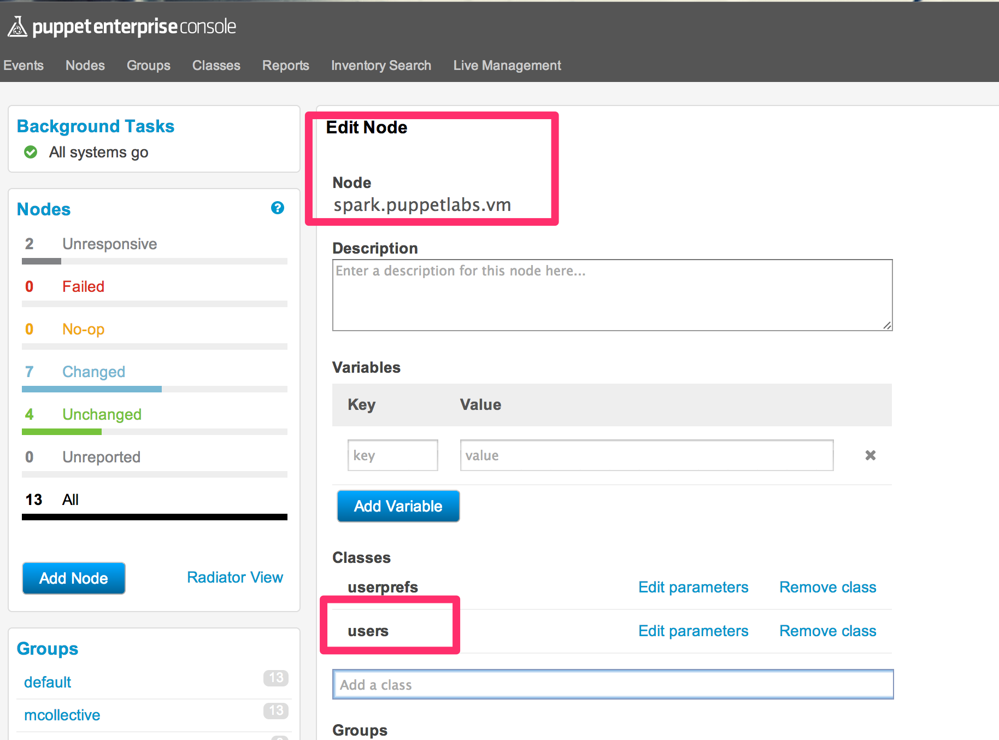
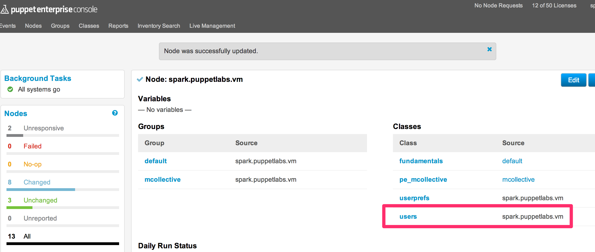

# Modules


## Lab 7.1 Deploy Your Module

```
[root@training ~/puppetcode:master±]# userdel fundamentals
[root@training ~/puppetcode:master±]# pwd
/root/puppetcode
[root@training ~/puppetcode:master±]# git st
# On branch master
# Untracked files:
#   (use "git add <file>..." to include in what will be committed)
#
# modules/
nothing added to commit but untracked files present (use "git add" to track)
[root@training ~/puppetcode:master±]# git add modules/
[root@training ~/puppetcode:master±]# git st
# On branch master
# Changes to be committed:
#   (use "git reset HEAD <file>..." to unstage)
#
# new file:   modules/users/manifests/admins.pp
# new file:   modules/users/manifests/init.pp
# new file:   modules/users/tests/admins.pp
# new file:   modules/users/tests/init.pp
#
[root@training ~/puppetcode:master±]# git commit -m 'Added users module'
Validating modules/users/manifests/admins.pp...
Validating modules/users/manifests/init.pp...
Validating modules/users/tests/admins.pp...
Validating modules/users/tests/init.pp...
[master 2cccc5c] Added users module
 4 files changed, 21 insertions(+), 0 deletions(-)
 create mode 100644 modules/users/manifests/admins.pp
 create mode 100644 modules/users/manifests/init.pp
 create mode 100644 modules/users/tests/admins.pp
 create mode 100644 modules/users/tests/init.pp
[root@training ~/puppetcode:master]# vi .git/
branches/       config          HEAD            index           logs/           ORIG_HEAD       
COMMIT_EDITMSG  description     hooks/          info/           objects/        refs/           
[root@training ~/puppetcode:master]# vi .git/hooks/
applypatch-msg.sample      post-receive.sample        pre-commit                 pre-rebase.sample          
commit-msg.sample          post-update.sample         pre-commit.sample          update.sample              
post-commit.sample         pre-applypatch.sample      prepare-commit-msg.sample  
[root@training ~/puppetcode:master]# vi .git/hooks/pre-commit
[root@training ~/puppetcode:master]# git push origin master
Counting objects: 11, done.
Compressing objects: 100% (7/7), done.
Writing objects: 100% (10/10), 871 bytes, done.
Total 10 (delta 0), reused 0 (delta 0)
remote: Updating Puppet Environment spark
remote: Fetching origin
remote: From /var/repositories/spark
remote:    bf7ac3c..2cccc5c  master     -> origin/master
remote: HEAD is now at 2cccc5c Added users module
To spark@master.puppetlabs.vm:/var/repositories/spark.git
   bf7ac3c..2cccc5c  master -> master
```

### Add 'users' class to my node







### puppet agent -t

```
Info: Retrieving plugin
...
Info: Applying configuration version '1407881595'
Notice: Hello spark.puppetlabs.vm
Notice: /Stage[main]/Main/Node[default]/Notify[Hello spark.puppetlabs.vm]/message: defined 'message' as 'Hello spark.puppetlabs.vm'
Notice: /Stage[main]/Users/User[fundamentals]/ensure: created
Notice: Finished catalog run in 10.02 seconds
```

### puppet agent --configprint environment

```
spark
```


